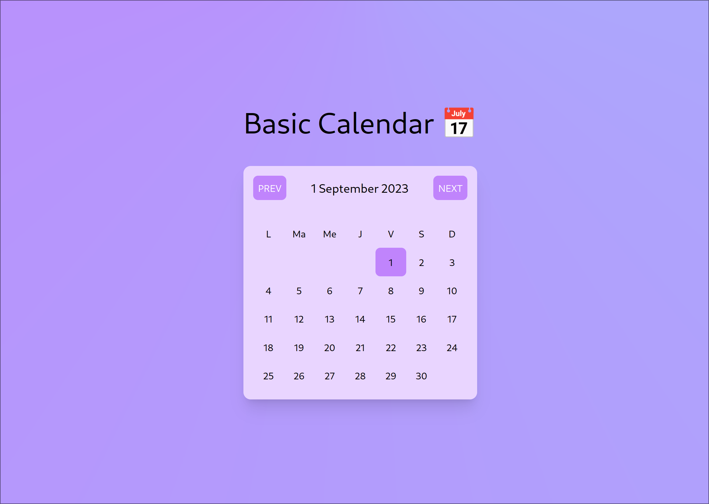
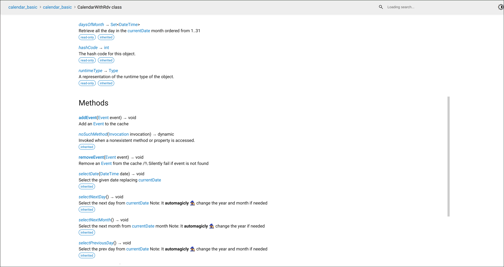

<!-- 
This README describes the package. If you publish this package to pub.dev,
this README's contents appear on the landing page for your package.

For information about how to write a good package README, see the guide for
[writing package pages](https://dart.dev/guides/libraries/writing-package-pages). 

For general information about developing packages, see the Dart guide for
[creating packages](https://dart.dev/guides/libraries/create-library-packages)
and the Flutter guide for
[developing packages and plugins](https://flutter.dev/developing-packages). 
-->

Small library implementing a Calendar api to navigate year,month, and days

## Features

- preselect a starting date
- move to prev/next month
- move to specific/prev/next date
- get all the days is the current month

## Getting started

Simply add it to your dependencies using `dart pub add basic_calendar`

## Usage
You have an example usage using ~bad~ `htmx` to render a html calendar in 
`/example` folder. 



### Testing the example

#### UPDATE DOCKERFILE

With the dockerfile just use those two commands :

```bash
docker build -t basic_http_server .
docker run -it -p 8080:8080 --rm --name basic_http_server basic_http_server
```

calendar will be available on your host machine on port 8080

You will find a provided .exe in the release tab, however I understand that running
a random exe from the world-WILD-web can be scary...

I you want to build it manually you simply need `dart` installed on your machine
then run this :

```bash
dart pub get
dart run example/basic_http_server.dart
```
click on the provided url and play with this masterpiece of a clendar 😎


If I have time you will also find a usage for flutter in the same folder


Here is a quick overview of the API

```dart
import 'package:calendar_basic/calendar_basic.dart';
void main() {
    const calendar = BasicCalendar(startDate: DateTime.now());
    // show the current select date in this calendar instance
    print(calendar.currentDate); 
    // get the list of day in the current month
    final Set<DateTime> daysOfMonth = calendar.daysOfMonth;
    // go to the next month and select its first day
    print(calendar.currentDate.month);
    calendar.selectNextMonth();
    print(calendar.currentDate.month);
    // and so on
}
```


## Tests
The project is fully covered by tests ! `see test folder` 🎉

If you want a more in depth description of the API use the doc in the `doc/api/index.html` folder (run index.html in your b browser)

## Additional information

Note for my professor : This is not a conventional way to use dart, I was juste trying things that I dont know
and wanted to try like `htmx` to make web pages it was fun but not pratical to use
